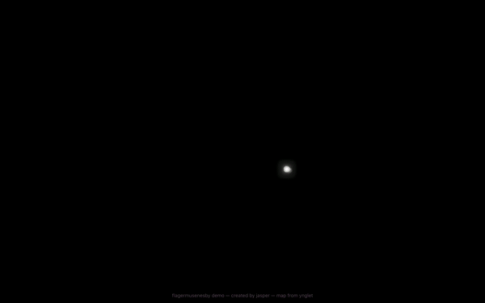

# Flagermusikby Demo

[](https://bats.jasperkatzban.com)

## Output
Try it out at [https://bats.jasperkatzban.com](bats.jasperkatzban.com)! Or scroll to learn how to run it locally.

## Concept
What if you could explore Copenhagen from the perspective of a bat? What might your favorite spots look like in echolocation? Might you think differently about how we share urban space with non-human beings? This is what Flagermusikby – in English, city of bat music – seeks to explore. As a (virtual) urban bat, you build an understanding of the urban world through a call and response of sound and light. Clicking sends out sound waves which reflect and reverberate off of nearby buildings and trees, creating music that helps you navigate. Discover how different materials react to your calls, and how different spaces create different music. The fun is endless!

## Process
The development of this experiment thus far has been a fun process. Initially, I knew I wanted to create something that could engage others more interactively than a paper, and with more visual appeal than a conventional data visualization. A website is a blank canvas that has the potential for both, and so much more: a game, a story, a body of research blended together without the constraints of other traditional formats. Field research into bats behavior around Copenhagen combined with analysis of field recordings of their vocalizations serve as the basis for this experience. In essence, Copenhagen’s bats understand their surroundings through echolocation. The mental map they build is certainly different from what we’d expect in something like Google Maps, but their goals are largely the same: find others and find food. Thus, this experience blends these ways of knowing the world into an abstract but recognizable journey through Copenhagen.

## Tech 
This project is built as a web experience, which is to say it is designed to run in a browser like Chrome or Safari. Though not mobile optimized (yet), the potential for social interactions with others in the world is vast considering most Copenhageners have a smartphone or tablet. Built in TypeScript, this web app uses [Rapier](https://rapier.rs/) for physics simulation, [Three.js](https://threejs.org/) for rendering, and the Web Audio API for sound generation. With this tech stack, it’s a basic proof of concept for a more developed web experience – one I’d like to continue developing beyond the end of this program.

## What’s Next
A joy of projects that are not-quite-science and almost-art is the amount of creative liberty available. While the sounds, places, and interactivity of the experience is inspired by the way urban bats explore the world, the web game format makes it possible to add aspects like color and custom sounds to the mix. Rather than a geographical map of Copenhagen, one can explore a compressed version of the city which features key landmarks but leaves out repetitive street spaces. In fact, the map used is a version of that used in the 2D platformer game Ynglet, which takes place in Copenhagen and has a similar gameplay experience. With this map format, I’m still working out how much educational text to include and, more broadly, how to structure a storyline that takes you on a journey towards conservation through your own authentic exploration.

## Running It
After checking out the repo:
```
npm install
npm start
```

Then navigate your browser to `localhost:4000`.


# Attribution

This project's structure is based off of [demo-rapier-three](https://github.com/viridia/demo-rapier-three/tree/main).

The map used in this project is based off of the platformer game [Ynglet](https://www.ynglet.com/).